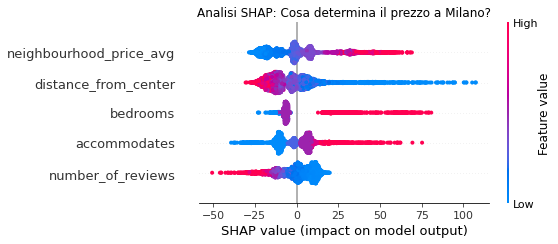

Airbnb Price Predictor - Milan 

This project aims to suggest the optimal nightly price for new Airbnb listings in Milan, Italy, using Machine Learning.

Project Overview

The goal is to help hosts determine a competitive price based on location, amenities, and historical data. I followed a full Data Science pipeline: from raw data cleaning to model deployment.

Tech Stack

Python (Pandas, Numpy)

Machine Learning: XGBoost, Scikit-learn

Model Interpretation: SHAP

Deployment: Streamlit Cloud

Key Features & Engineering

Target Encoding: Optimized neighborhood data by using median prices per area.

Geospatial Analysis: Calculated the Haversine distance from the Duomo (city center) and proximity to Metro stations.

Feature Engineering: Created custom metrics like bathrooms_per_person to better capture guest comfort.

Outlier Removal: Focused the model on the core market (40€ - 450€) to increase reliability.

Using SHAP values, I discovered that the most influential factors for pricing in Milan are:

Neighborhood Price Median (Location prestige)

Distance from Duomo (Proximity to center)

Below is the SHAP Summary Plot, showing how different features influence the final price:

This application is deployed on Streamlit

https://previsione-prezzi-milano.streamlit.app/

##  Work in Progress
I am currently working to improve the model's accuracy (targeting an R² > 0.60). My next steps include:
- Possible **Sentiment Analysis**: Implementing NLP on user reviews to capture "quality" and "hospitality" scores.
- **Enhanced Geospatial Data**: Adding proximity to Milan's Metro stations and main attractions (e.g., San Siro, Navigli).
- **Hyperparameter Tuning**: Running a more extensive GridSearch to squeeze more performance out of XGBoost.

