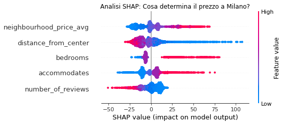

# Airbnb Price Predictor - Milan 

This personal data science project explores the prediction of nightly prices for Airbnb listings in Milan, Italy, using machine learning.

## Project Overview

The project applies a data science workflow to real-world Airbnb data, including data cleaning, exploratory data analysis, feature engineering, regression modeling, model evaluation, and interpretation.

The goal was to experiment with property and location-based features and investigate their relevance for predicting Airbnb listing prices.

## Tech Stack

- Python (Pandas, Numpy)

- Machine Learning: XGBoost, Scikit-learn

- Model Interpretation: SHAP

- Deployment: Streamlit Cloud

## Key Features & Engineering

Some of the features explored in the project include:

- **Neighborhood information:** Used neighborhood-level median prices to capture price differences across areas.
- **Geospatial features:** Calculated the Haversine distance from the Duomo and proximity to Milan Metro stations.
- **Property features:** Created derived variables such as `bathrooms_per_person`.
- **Outlier filtering:** Restricted the analysis to listings in the €20–€390 price range.

## Model Interpretation

I used SHAP values to explore how different features contributed to the model predictions.

Among the most influential features were:

- Neighborhood median price
- Distance from the Duomo

The SHAP summary plot below provides an overview of the contribution of the different features:

## Model Performance

The XGBoost regression model achieved approximately:

- **R²:** 0.50
- **Mean Absolute Error (MAE):** €33

These results indicate that the model captures part of the variability in listing prices, while leaving substantial room for improvement. Possible limitations include relevant factors that are not represented in the available data, such as property condition, interior design quality, and aspects related to host reputation.

## Demo

A preliminary Streamlit demo of the model is available here:

[Airbnb Price Predictor - Milan](https://previsione-prezzi-milano.streamlit.app/)

## Possible Improvements

Possible directions for further development include:

- Exploring information from user reviews using NLP techniques.
- Expanding geospatial features to include additional points of interest.
- Exploring additional models and hyperparameter tuning.
- Improving the organization and reproducibility of the data processing and modeling workflow.

